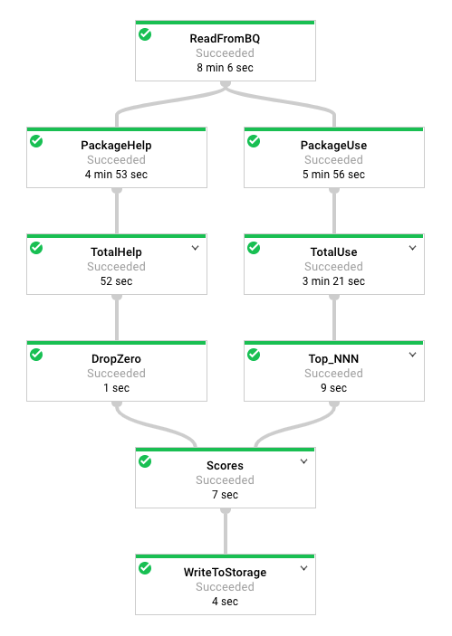

# Serverless Data Analysis with Dataflow: Side Inputs(Python)
이 실습에서는 BigQuery에 데이터를 로드하고 복잡한 쿼리를 실행하는 방법을 알아본다.  
다음으로 매핑 및 축소 작업을 수행하고 Side Input을 사용하며 BigQuery로 스트리밍할 수 있는 Dataflow 파이프라인을 실행한다.

### 목적
BigQuery를 Dataflow의 데이터 소스로 사용하는 방법과 파이프라인 결과를 다른 파이프라인의 Side Input으로 사용하는 방법을 알아보자
- BigQuery에서 Dataflow로 데이터 읽기
- 파이프라인의 출력을 다른 파이프라인에 대한 Side Input으로 사용

## 작업 1. 준비
### Dataflow 개발자 역할 할당
계정에 Dataflow Developer 역할이 없으면 권한 오류가 뜨므로 설정해줘야한다.  
1. IAM에 접속하여 default compute developer 계정을 선택
2. 오른쪽 연필 모양의 편집 옵션을 선택
3. 다른 역할 추가를 클릭하고 Dataflow Developer를 선택하고 저장

### Dataflow API가 성공적으로 사용 설정되었는지 확인
1. Cloud Console에서 상단 검색창에 Dataflow API를 입력
2. 관리 클릭
3. API 비활성화를 클릭 후 비활성화가 되면 다시 사용을 클릭

Dataflow API를 초기화하는 작업임

### SSH 터미널을 열고 학습 VM에 연결
- VM 인스턴스에 접속하여 training-vm 인스턴스의 SSH에 접속
퀵랩에서는 training-vm을 자동으로 생성해주지만 개인 계정으로 할 때 밑의 설정을 해줘야한다.

    

    
개인 계정으로 진행할 때 클릭

    
       

    - 퀵랩환경이 아닌경우에는 "training-vm" 가상머신을  생성한 다음 SSH접속 후 아래 설치 명령을 먼저 수행한다  
    [`주의`]:VM생성시 [`ID 및 API 액세스`]의 [`액세스 범위`]에서 [`모든 Cloud API에 대한 전체 액세스 허용`]을 선택해주고 생성한다

    - [`Debian git 설치`]  
    sudo apt update  
    sudo apt install git

    - [`가상머신에 python3과 apache-beam설치`]  
    sudo apt-get -y install python3-pip  
    pip install apache-beam[gcp]

    - BUCKET="jnu-idv-xx"  
    echo $BUCKET

    - PROJECT="jnu-idv-xx"
    echo $PROJECT

    

    

### 코드 저장소 다운로드
- 이 실습에서 사용할 코드 레포를 깃허브에서 다운로드 한다.
- training-vm SSH터미널에서 다음을 입력
    ~~~
    git clone https://github.com/GoogleCloudPlatform/training-data-analyst
    ~~~

### Cloud Storage 버킷 만들기

1. Cloud Storage에서 버킷 클릭
2. 만들기를 클릭하고 이름은 Project ID로 설정, 위치 유형은 Multi-region으로 설정한 후 만들기 클릭

## 작업 2. BigQuery 쿼리 사용 시도
1. 콘솔에서 BigQuery를 클릭
2. 새 쿼리 작성을 클릭하고 다음 쿼리 입력
    ~~~SQL
    SELECT
        content
    FROM
        `cloud-training-demos.github_repos.contents_java`
    LIMIT
        10
    ~~~
3. 실행 클릭  
BigQuery 테이블에는 fh-bigquery.github_extracts.contents_java_20162016년 GitHub에 있는 모든 자바 파일의 콘텐츠(및 일부 메타데이터)가 포함되어 있음
4. 테이블에 있는 Java 파일 수를 확인하려면 다음 쿼리를 입력하고 실행 클릭
    ~~~sql
    SELECT
        COUNT(*)
    FROM
        `cloud-training-demos.github_repos.contents_java`
    ~~~

## 작업 3. 파이프라인 코드 탐색
1. training-vm SSH 터미널로 돌아가서 밑의 디렉토리로 접속
    ~~~
        cd ~/training-data-analyst/courses/data_analysis/lab2/python
        nano JavaProjectsThatNeedHelp.py
    ~~~
    코드 변경 X  

    

    
파이프라인 다이어그램 보기

    
       

    

    

    

    

    
파이프라인 코드 보기

    
       

    ~~~shell
    import argparse
    import logging
    import datetime, os
    import apache_beam as beam
    import math

    # Global values
    TOPN=1000

    ### Functions used for both main and side inputs

    # 주어진 패키지 이름을 .으로 구분해서 스플릿
    def splitPackageName(packageName): 
        """e.g. given com.example.appname.library.widgetname
                returns com
                        com.example
                        com.example.appname
            etc.
        """
        result = []
        end = packageName.find('.')
        while end > 0:
            result.append(packageName[0:end])
            end = packageName.find('.', end+1)
        result.append(packageName)
        return result

    # 특정 keyword 다음에 있는 패키지 이름을 추출하고 splitPackageName 함수를 사용하여 해당 패키지 이름을 서브 패키지들의 리스트로 반환하는 함수
    # 작동 방식은 라인에서 keyword의 시작위치를 찾고, keyword 다음에 있는 세미콜론의 위치를 찾아 end 변수에 저장.
    # 그 이후 start가 end보다 작으면(문자열이 존재하면) 서브 패키지들의 리스트로 변환 후 리스트 반환
    # start가 end보다 크거나 같으면(문자열이 없으면) 빈 리스트 반환
    def getPackages(line, keyword):
        start = line.find(keyword) + len(keyword)
        end = line.find(';', start)
        if start < end:
            packageName = line[start:end].strip()
            return splitPackageName(packageName)
        return []

    def packageUse(record, keyword):
        if record is not None:
            lines=record.split('\n')
            for line in lines:
                if line.startswith(keyword):
                    packages = getPackages(line, keyword)
                    for p in packages:
                        yield (p, 1)

    def is_popular(pcoll):
        return (pcoll
            | 'PackageUse' >> beam.FlatMap(lambda rowdict: packageUse(rowdict['content'], 'import'))
            | 'TotalUse' >> beam.CombinePerKey(sum)
            | 'Top_NNN' >> beam.transforms.combiners.Top.Of(TOPN, key=lambda kv: kv[1]) )

    def packageHelp(record, keyword):
        count=0
        package_name=''
        if record is not None:
            lines=record.split('\n')
            for line in lines:
            if line.startswith(keyword):
                package_name=line
            if 'FIXME' in line or 'TODO' in line:
                count+=1
            packages = (getPackages(package_name, keyword) )
            for p in packages:
                yield (p,count)
        def needs_help(pcoll):
        return (pcoll
            | 'PackageHelp' >> beam.FlatMap(lambda rowdict: packageHelp(rowdict['content'], 'package'))
            | 'TotalHelp' >> beam.CombinePerKey(sum)
            | 'DropZero' >> beam.Filter(lambda packages: packages[1]>0 ) )

    # Calculate the final composite score
    #
    #    For each package that is popular
    #    If the package is in the needs help dictionary, retrieve the popularity count
    #    Multiply to get compositescore
    #      - Using log() because these measures are subject to tournament effects
    #

    def compositeScore(popular, help):
        for element in popular:
        if help.get(element[0]):
            composite = math.log(help.get(element[0])) * math.log(element[1])
            if composite > 0:
                yield (element[0], composite)
    

    # Define pipeline runner (lazy execution)
    def run():

        # Command line arguments
        parser = argparse.ArgumentParser(description='Demonstrate side inputs')
        parser.add_argument('--bucket', required=True, help='Specify Cloud Storage bucket for output')
        parser.add_argument('--project',required=True, help='Specify Google Cloud project')
        group = parser.add_mutually_exclusive_group(required=True)
        group.add_argument('--DirectRunner',action='store_true')
        group.add_argument('--DataFlowRunner',action='store_true')

        opts = parser.parse_args()

        if opts.DirectRunner:
            runner='DirectRunner'
        if opts.DataFlowRunner:
            runner='DataFlowRunner'

        bucket = opts.bucket
        project = opts.project

        #    Limit records if running local, or full data if running on the cloud
        limit_records=''
        if runner == 'DirectRunner':
            limit_records='LIMIT 3000'
        get_java_query='SELECT content FROM [cloud-training-demos:github_repos.contents_java] {0}'.format(limit_reco>

        argv = [
            '--project={0}'.format(project),
            '--job_name=javahelpjob',
            '--save_main_session',
            '--staging_location=gs://{0}/staging/'.format(bucket),
            '--temp_location=gs://{0}/staging/'.format(bucket),
            '--runner={0}'.format(runner),User
            '--region=us-central1',
            '--max_num_workers=5'
            ]

        p = beam.Pipeline(argv=argv)

        # Read the table rows into a PCollection (a Python Dictionary)
        bigqcollection = p | 'ReadFromBQ' >> beam.io.Read(beam.io.BigQuerySource(project=project,query=get_java_quer>

        popular_packages = is_popular(bigqcollection) # main input

        help_packages = needs_help(bigqcollection) # side input

        # Use side inputs to view the help_packages as a dictionary
        results = popular_packages | 'Scores' >> beam.FlatMap(lambda element, the_dict: compositeScore(element,the_d>

        # Write out the composite scores and packages to an unsharded csv file
        output_results = 'gs://{0}/javahelp/Results'.format(bucket)
        results | 'WriteToStorage' >> beam.io.WriteToText(output_results,file_name_suffix='.csv',shard_name_template>

        # Run the pipeline (all operations are deferred until run() is called).

        if runner == 'DataFlowRunner':
            p.run()
        else:
            p.run().wait_until_finish()
        logging.getLogger().setLevel(logging.INFO)

    if __name__ == '__main__':
    run()
    ~~~

    

    
  

2. 다음 질문에 답하십시오.

- 맨 위에 있는 클래스 문서를 보면 이 파이프라인의 목적은 무엇입니까?
- 콘텐츠의 출처는 어디입니까?
- 파이프라인의 왼쪽은 무엇을 합니까?
- 파이프라인의 오른쪽은 무엇을 합니까?
- ToLines는 무엇을 합니까? (힌트: BigQuery 결과의 콘텐츠 필드를 확인하세요.)
- ReadFromBQ의 결과가 다른 단계로 직접 전달되지 않고 명명된 PCollection에 저장되는 이유는 무엇입니까?
- ReadFromBQ에서 생성된 PCollection에서 수행되는 두 가지 작업은 무엇입니까?
- 파일의 내용에 3개의 FIXME와 2개의 TODO가 있는 경우(서로 다른 줄에) 얼마나 많은 도움 요청이 관련되어 있습니까?
- 파일이 com.google.devtools.build 패키지에 있는 경우 연결된 패키지는 무엇입니까?
- Popular_packages 및 help_packages는 둘 다 PCollection이라는 이름을 가지며 둘 다 파이프라인의 점수(부차 입력) 단계에서 사용됩니다. 어느 것이 메인 입력이고 어느 것이 사이드 입력입니까?
- 점수 단계에서 사용되는 방법은 무엇입니까?
- 점수 단계에서 부차 입력이 변환되는 Python 데이터 유형은 무엇입니까?

## 작업 4. 파이프라인 실행
이 프로그램에는 BUCKET 및 PROJECT 값과 --DirectRunner를 사용하여 로컬에서 파이프라인을 실행할지, --DataFlowRunner를 사용하여 클라우드에서 실행할지 여부가 필요
- 로컬에서 파이프라인 실행하기  
training-vm SSH 터미널에서 다음을 입력해서 로컬에서 파이프라인 실행
    ~~~
    python3 JavaProjectsThatNeedHelp.py --bucket $BUCKET --project $PROJECT --DirectRunner
    ~~~
- 클라우드에서 파이프라인 실행하기
    ~~~
    python3 JavaProjectsThatNeedHelp.py --bucket $BUCKET --project $PROJECT --DataFlowRunner
    ~~~

----
- 결과 확인  
Cloud Storage 버킷에서 javahelp 폴더에서 결과를 찾을 수 있음  
클라우드에서 실행했을 때 Dataflow의 작업에서 진행 상황 모니터링 가능  
두 파일 이름은 동일하지만 파일 생성 시간이 다른 것을 볼 수 있음