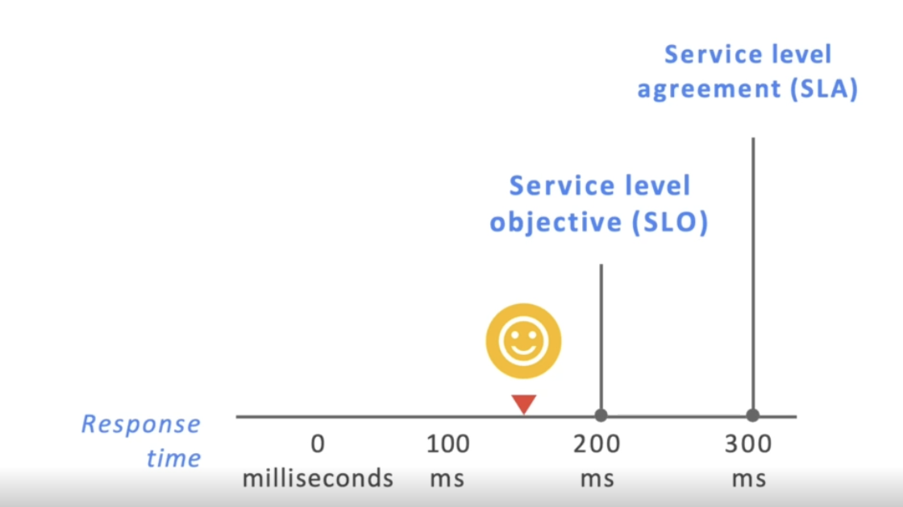
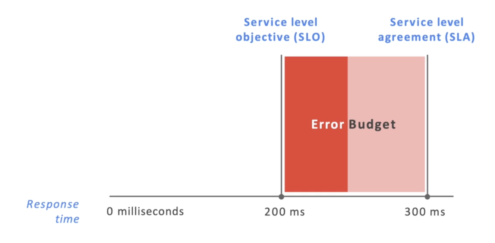

# Monitoring Cloud IT Services and Operation
## IT development and operations challenges
- Adjust expectations for service availability
- Adopat best practices from DevOps and Site Reliability Engineering

### Standard parctices
- Service level agreement(SLA) -> 서비스의 성능을 고객 간의 계약으로서 보장
- Service level objectives(SLO) -> The goal for your cloud service performance level. 적어도 목표보다 더 나은 성능이 나와야함. SLO와 SLA 사이의 성능이라면 공급자 입장에선 조금 마음에 안들 수 있는데 고객 입장에서는 불만은 없을 수 있음

- Service level indicators(SLI) -> 제공하고 있는 서비스 레벨의 척도 Error Budget

이런 것들을 통해서 서비스의 성능 기대치를 조정하고 유지하고 운영할 수 있음.

## DevOps and SRE

### DevOps의 5가지 원칙
1. Reduce silos
2. Accept failure as normal
3. Implement gradual change
4. Leverage tooling and automation
5. Measure everything

DevOps -> 철학, 협업적이고 책임감있는 데이터 문화에 대한 개념적 접근 방식
SRE(Site Reliability Engineering) -> 이러한 철학의 실질적인 구현에 관한 것, 실행 지침

### SRE의 5가지 목표
1. Reduce silos - Shared ownership
2. Aceept failure as normal
3. Implement gradual change - Reduce the cost of failure (많은 프로토타입)
4. Leverage tooling and automation - Toil automation
5. Measure everything

## Google Cloud resource monitoring tools - The tools included in Google Cloud's opreations suit fall
### Operations-focused tools
- Cloud Monitoring
- Cloud Logging 
    - 모니터링이지만 로그파일을 모으는 것
    - Developers, DevOps, System Admins가 보다 쉽게 통찰력을 얻고 애플리케이션 및 인프라 내 문제를 파악 가능
    - Fully managed service
- Error Reporting
- Service Monitoring

### Application performance management tools
- Cloud Debugger (개발자를 위한 툴)
    - 애플리케이션 실행 중에 디버그 가능
    - 다운타임이 없음, 사용자 영향x
- Cloud Trace (개발자를 위한 툴)
    - 모듈 별로 나눠져 있는 것들을 추적
    - 분산 추적 시스템으로써 오류를 찾아냄
- Cloud Profiler
