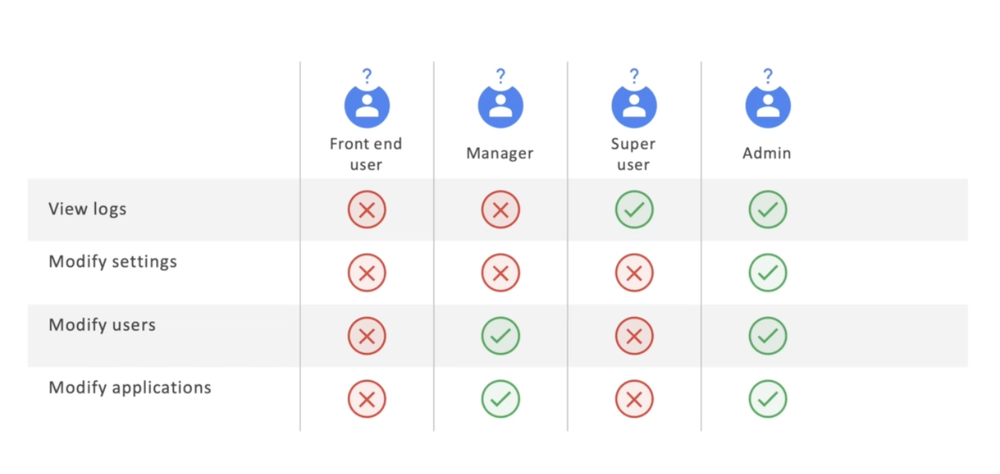
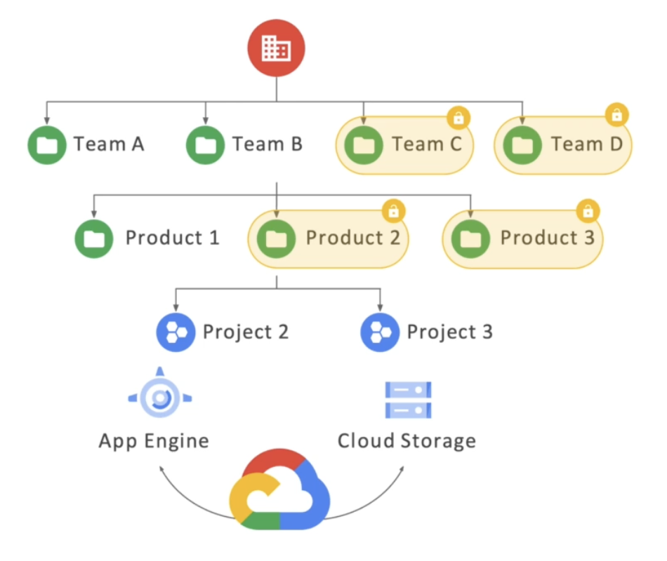

# Security in the cloud

## Funcdamental terms: Privacy, security, compliance and availability

### Privacy
    개인이 또는 조직이 access할 수 있는 데이터, 이 데이터가 누구와 공유될 수 있는지 등등

### Security
    정책이고 절차고 제어를 의미. 자물쇠나 금고의 비밀번호 같은 수단

### Compliance
    데이터 보안을 한 단계 더 향상, 의료나 은행이나 국가기관이나 규제가 심한 사업에서

### Availability
    데이터에 대한 무단 access를 방지해야하지만 언제든지 필요할 때 사용가능하게 해야함. 보안과 같이 안정성과 직결됨. 그래서 접근할 수 있는 시간단위를 제공.

- 99.9999% availability
- 5 minutes unavailable per year

### Google Workspace
1. you own your data, not Google.
2. Google does not sell customer data to third parties
3. All customer data is encrypted by default
4. Google Cloud guards against insider access to your data
5. We never give any government entity "backdoor" access to your data
6. Our privacy practices are audited against international standards

### Today's top cyber security challenges

기존의 legacy 시스템은 경계 기반 보안 접근 방식에 의해 돌아가고 있음. 다른 것들은 못들어오게 방화벽으로 보호.

### 보안의 위험
- Phishing attacks
- Physical damage
- Malware attacks

## Shared Responsibility Model

### Google Cloud's multilayer approach to security

- Hardware -> 자체적으로 거의 모든 하드웨어를 직접 설계하고 구축
- Software -> 타이탄이라는 것이 운영체제와 나머지 배포 소프트웨어 스택을 계속적으로 확인
- Storage -> 암호화(키), 유휴 데이터 암호화(쓰지않고 저장되어있는 데이터까지 다 디폴트로 암호화)
- Identity -> zero trust, 나만 볼 수 있게 되어있음, 내가 공유할 것들을 선택
- Network -> 전송 중에 암호화됨
- Operations -> 보안전문가들이 24시간 모니터링

### Three components of Google Cloud's defense=in-depth data security design
    Sharding, encryption key, key encryption key

### Google Cloud's principle for granting access to users
    -> "Least privilege" 최소한의 권한

### 기업 입장에서의 공유 책임

## Identity and Access Management(IAM)
### Who/ can do what/ on which resource
- who -> 구글에 대한 계정, 구글의 그룹, 서비스 계정, 워크스페이스, 도메인
- can do what -> Primitive, Predefined, Custom
    - Primitive -> Owner, Editor, Viewer
    - Predefined -> 미리 정해진 역할들
    - Custom -> 권한 커스터마이징 가능, 조직이 직접 관리해야함

## Resource hierarchy

