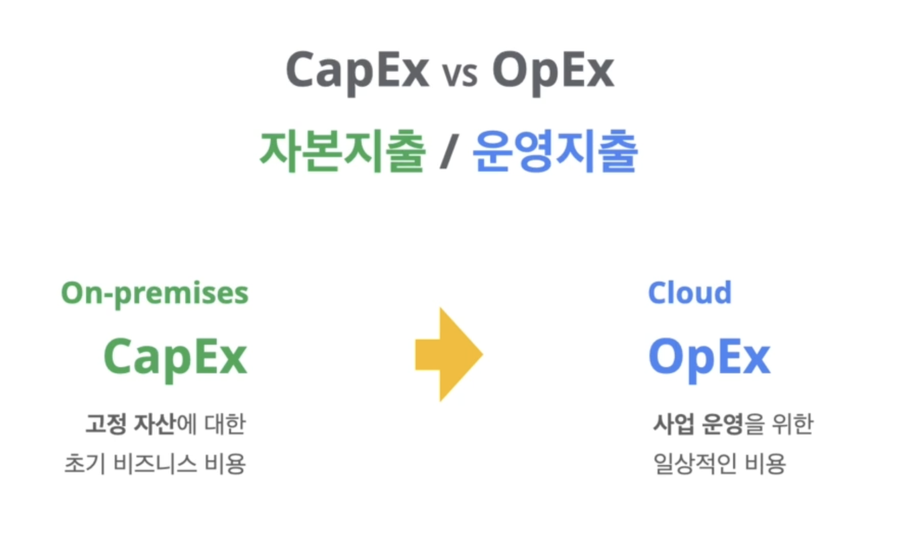

# Let's Go _ Google Digital Leader

### 출제 영역
1. Digital Transformation with Google Cloud | 10%
2. Innovating with Data and Google Cloud | 30%
3. Infrastructure and Application Modernization with Google Cloud | 30%
4. Understanding Google Cloud Security and Operations | 30%

# Why Cloud Technology is Transforming Business

## Digital Transformation with Google Cloud
    클라우드와 같은 새로운 기술을 사용하여 급변하는 시장의 요구사항을 충족하기 위해 비즈니스 프로세스부터 문화 및 고객 경험을 새롭게 전환하는 것
- 혁신 촉진
- 새로운 수익모델 창출
- 시장변화 신속 적응
- 고객요구 신속 대응
- 애플리케이션 현대화
- 새로운 서비스 창출
- 가치 제공
- 운영방식 변화
- 고객, 직원 및 파트너와의 관계를 재정의

## What is the cloud?
    Metaphor for the network of data centers which store and compute information that's available through the internet.  
    "인터넷을 통해 사용할 수 있는 정보를 저장하고 계산하는 데이터 센터 네트워크에 대한 메타포(은유)"

## 인프라

## On-premises (On-prem)
설명 및 장점
- 기업 내 데이터센터에 위치 및 운영
- IT 인프라를 관리하는 전통적인 방법
- 타사 액세스 필요 없음
- 소유자에게 서버 하드웨어 및 소프트웨어에 대한 물리적 제어권 부여
- 지속적인 액세스에 대한 비용 지불 필요 없음

단점
- 초기에 모든 서버 하드웨어와 소프트웨어 구입 필요
- 충분한 전력과 냉각 기능이 있는 데이터센터 필요
- 시스템 전문 관리자 필요
- 수요가 급증하거나 비즈니스가 확장될 때 서버 하드웨어와 소프트웨어의 확장 어려움
- 필연적인 잉여 리소스

## Private cloud
- 단일 조직(기업) 전용
- Single-tenant 또는 Corporate cloud로도 불림
- 온프레미스와 동일한 유지보수 및 관리 수행

사용 이유
- 셀프 서비스, 확장성 및 탄력성
- 온프레미스 인프라에서 더 많은 커스터마이징 기능 제공
- 자체 인프라가 이미 있거나 규제상의 이유로 사용

## Public cloud
- 타사 공급자의 인프라에 여러 "테넌트"
- 각 테넌트의 데이터와 어플리케이션은 서로 숨겨짐
- Cloud = Public cloud
- 컴퓨팅 및 인프라 리소스의 온디맨드 가용성 제공
- 리소스를 직접 구입, 구성 또는 관리할 피룡 없음
- 사용한 만큼만 비용 지불

퍼블릭 클라우드 종류
- Infrastructure as a service (IaaS)
- Platform as a service (PaaS)
- Software as a service (SaaS)

## Hybrid cloud
    = On-premises + Google Cloud

## Hybrid + Multicloud
    = On-premises + Multiple public cloud

## The benefits of cloud computing

###  Scalable (확장성)
- 확장 가능한 리소스
- 최신 기술 온디멘드
- 구축 시간 단축
### Flexible (유연성)
- 어디서나 서비스 액세스
- 서비스 확장
- 서비스 축소
### Agile (민첩성)
- 기본 인프라에 대한 걱정 없이
- 새로운 애플리케이션을 개발하고
- 이를 신속하게 운영 환경에 도입
### Strategic value (전략적 가치)
- 경쟁 우위 확보
- 더 높은 투자 수익
- 새로운 아이디어로 더 빠르게 혁신하고 시도
### Secure (안정성)
- 전문적인 보안 전담 팀
- 전문적인 보안 메커니즘
- 일반 기업 데이터 센터 보안보다 안전
### Cost-effective (비용 효율성)
- 사용하는 컴퓨팅 리소스 비용만 지불
- 데이터 센터 증설 필요 없음
- IT 직원이 전략적인 이니셔티브를 수행

### "디지털 전환은 일회성 노력이 아닌 지속적인 과정이다"

### Digital Transformation with Google Cloud
- 새로운 기술을 발전
- 더 나은 서비스를 고객에게 제공
- 경쟁 우위를 확보할 수 있는 기회

## Cloud eras
    VM Cloud Era -> Infrastructure Cloud Era -> Transformation Cloud Era

### VM Cloud Era
- 가상 머신 시스템
- 하드웨어 구매 및 운영 불필요
- 클라우드 네이티브 기업들, IT 스타트업

### Infrastructure Cloud Era
- 클라우드 인프라에다 마이그레이션
- 비용절감
- 더 나은 보안, 빠른 개발
- 새로운 기능 구축에 집중
### Transformation Cloud Era
- App and infrastructue modernization (애플리케이션과 인프라의 현대화)
- Data democratization (데이터 민주화)
- People connections 
- Trusted transactions (신뢰할 수 있는 트랜잭션)
- Benefits from cloud computing
- Drives innovation
- Generates new revenue streams
- Adapts quickly to market changes
- Adapts quickly to customer needs

## Challenges that lead to a digital transformation
- ### 기업들은
- ### Be the best at understanding and using data
- ### Want the best technology infrastructure
- ### Create the best hybrid workplace
- ### Know their data, systems, and users are secure
- ### Prioritize sustainability (지속성이라고 해석할 수 있지만 친환경적인 것을 선호)

## Google's Transformation Cloud
### 주요 기능
- 데이터
- 개방형 인프라
- 협업
- 보안
- 친환경 기술

### 데이터
- 인공지능 학습으로 가치를 끌어내는 열쇠
- 혁신과 차별성이 중요
- 데이터 클라우드 - 확장성, 속도, 보안, 안정성
- Ford, Spotify, Wayfair, UPS 같은 회사들에서 사용

### 개방형 인프라
- 오픈소스 기반 하이브리드, 멀티 클라우드
- 유연한 애플리케이션 구축, 마이그레이션 및 관리
- 단일 클라우드 사용 의존을 줄임
- 다양한 타 솔루션 수용

### 협업
- 일하는 방식을 바꾸는 클라우드 기반 협업 솔루션
- Covid-19으로 인한 하이브리드 업무 환경
- 구글 워크스페이스 등

### 보안
- 사이버 보안 위협의 증가
- 더 안전한 클라우드의 보안을 쉽고 단순하게 적용

### 친환경 기술
- 환경보호를 위한 친환경 기술의 니즈가 높아짐
- 클라우드 컴퓨팅은 세계 탄소배출량을 크게 줄임
- 클라우드로 전환으로 탄소배출 절감에 동참
- 구글을 타 데이터 센터보다 2배 효율 운영

### Open standard와 Open source
    Open standard -> XML, http:// 같은 개념  
    Open source -> 텐서플로우나 쿠버네티스 같은 것들 사용하는 누구나 변경하고 내용을 수정하여 사용 가능

## The Google Cloud Adoption Framework
    조직이 클라우드 전환을 어떻게 접근할 수 있을까?

### The framework structures and aligns
- Short-term tractical objectives
- Mid-term strategic objectives
- Long-term transformational objectives

||Learn|Lead|Scale|Secure|
|:---:|:---:|:---:|:---:|:---:|
|Tactical|Self-taught, 3rd-party reliance|Teams by function, heroic project manager|Change is slow and risky, ops heavy|Fearof public internet, but trust in private network
|Strategic|Organized training, 3rd-party assisted|New cross-functional cloud team|Templates ensure good governance without manual review|Central identity, hybrid network
|Transformational|Peer learning and sharing, 3rd-party staff aug. only|Cross-functional feature teams, greater autonomy|All change is constant, low risk, and quickly fixed|Trust only the right people, devies, and services|
