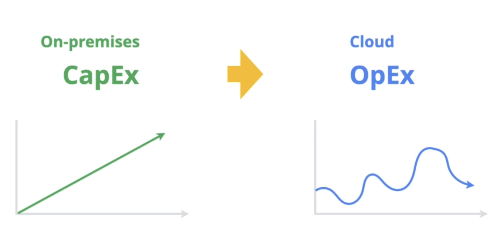

# Fundamental Cloud Concepts

## Total cost of ownership(TCO) - 총 소유 비용
    On-premises와 Cloud 사이에 비용이 어떤 것이 더 많이드나 비교

|On-premises|Cloud|
|:---:|:---:|
전력 | 월별 비용
냉각 | 사용량별 비용
유지관리 |
지원서비스|

## Capital expenditures (CapEx) VS Operating expenses (OpEx)

- 클라우드로 전환시 자본지출에서 운영지출로 변경

- CapEx는 직선구조로써 처음 비용이 비싸지만 처음 구매한 걸 계속 사용 가능
- OpEx는 시기에 따라서 비용이 달라질 수 있음. 지속적으로 비용 변화. 따라서 예측하기 어려움. 하지만 냉각이나 전력 등 비용에선 아낄 수 있음.

## Private cloud, bybrid cloud, and multi-cloud strategies
    조직이 Cloud에 의존하고 Cloud만 사용한다는 것은 당연히 맞지 않음. 따라서 어떻게 활용하느냐가 중요

### Private cloud
    조직이 인프라 투자를 많이 해놨거나 규제 상의 이유로 사내에서 데이터를 보관해야할 때 사용 가능
- 자체 데이터센터 또는 프라이빗 클라우드
- 로컬 서버가 아닌 인터넷 액세스
- 셀프서비스, 확장성, 탄력성
- 로컬 서버보다 많은 커스터마이징

### Hybrid cloud
    On-premises와 Google Cloud같은 퍼블릭 클라우드가 합쳐진 형태, 많은 조직이 사용하는 형태

### Multi cloud
    여러 클라우드를 결합해서 사용하는 형태, 유연하고 각각 클라우드 플랫폼들의 장점을 효율적으로 조직 내에 결합시킬 수 있음

### hybrid나 multi같은 여러가지 복합적인 형태가 되었을 때 장점
1. Access to the latest technologies
- Best-in-class approach to cloud features
- Scale, security, and agility to innovate fast
- Advanced capabilities

2. Modernize at the right pace
- Migrate at a pace that makes sense
- Transform technical infrastructure over time 

3. Improved return on investment
- Expand cloud computing capacity without increasingi data center expenses
- Reduce CapEx or general IT spending
- Improve transparency

4. Flexibility through choice of tools
- Wider choice of tools and developer talent
- Better response to changing market demands
- Avoid vendor lock-in concerns

5. Improve reliability and resiliency
- Distribute core workloads across multiple cloud and on-premises infrastructures
- Reduce downtime
- Reduce concerns about over-dependance on a single source of failure
- Improve quality and availability of a service

6. Maintain regulatory compliance
- Ensure compliance with regional data governance, residency, or digital sovereignty requirements

7. Runnig apps on-premises
- Freedom to innovate while still meeting legacy technology needs

8. Running apps at remote edge locations
- Meet performance and latency requirements
- Run select apps at the network edge

# How a network supports digital transformation

## Network performance: Bandwidth and Latency

### Bandwidth
    파이프의 두께라고 생각하면됨. 파이프가 두꺼울수록 같은 시간동안 더 많은 양의 물을 받을 수 있음.
- 네트워크가 주어진 시간 동안 얼마나 많은 데이터를 전송할 수 있는지를 측정하는 척도
- "초당 메가비트" 또는 초당 기가비트"로 측정
- 대역폭이 클수록 컴퓨터가 인터넷에서 정보를 더 빨리 다운로드  

### Latency
    파이프에서 물을 트는 위치라고 보면 됨. 물을 트는 위치가 입구에 가까우면 더 빨리 물이 나오고 멀리 있으면 더 늦게나오는 느낌.
- 데이터가 한 지점에서 다른 지점으로 이동하는 데 걸리는 시간
- 밀리초 단위로 측정(ms)
- 네트워크를 통한 통신 지연을 의미

## Google Cloud regions and zones
- Europe
- North America
- South America
- Asia
- Australia

Location > Regions > Zones

## Google's Edge Network
    google 서비스를 사용할 때 가장 빠르게 나의 위치와 가까운 region으로 연결

### Network's edge
    Entry point to the network
- High performance
- High reliability
- Low latency
