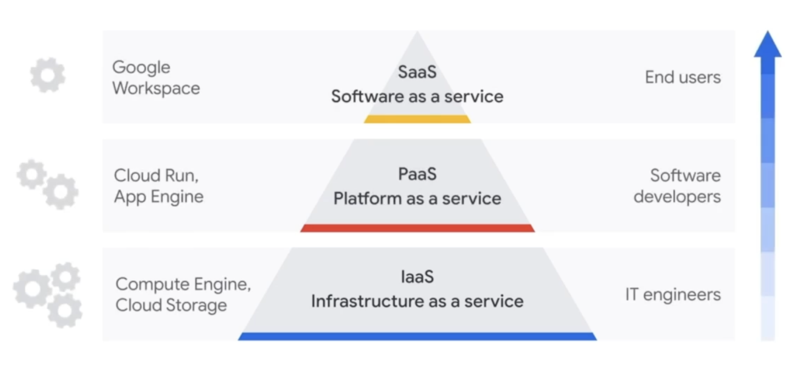
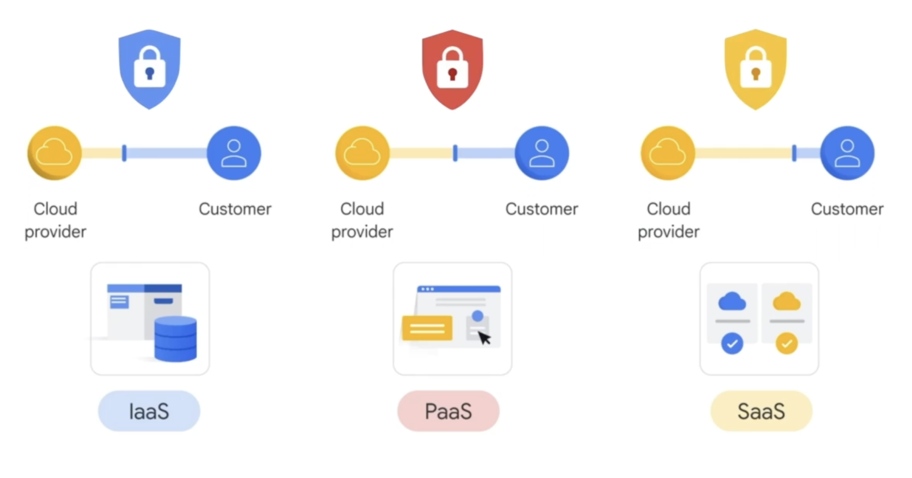
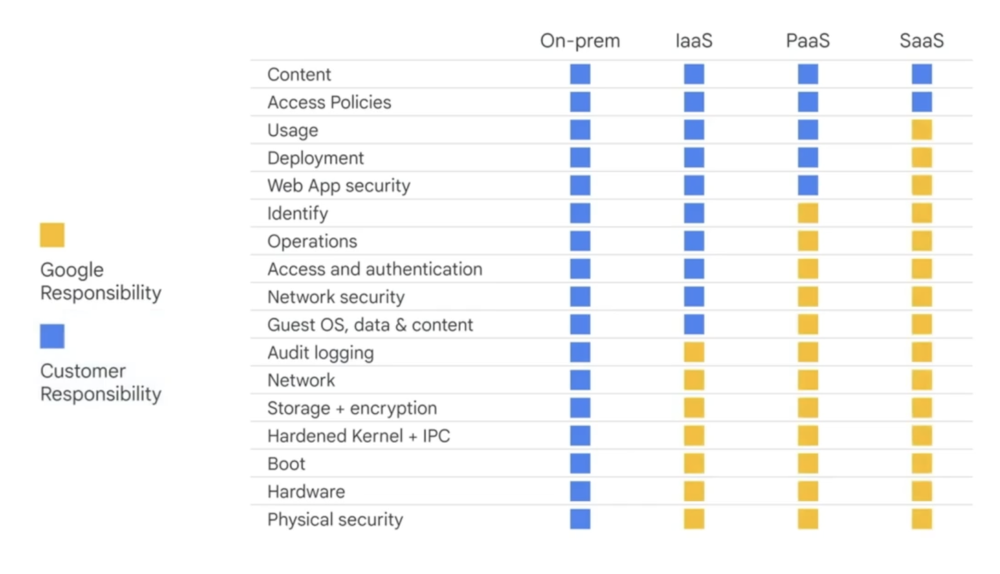

# Cloud computing models and shared responsibility

## Cloud computing service models

- Infrastructure as a service (IaaS)
- Platform as a service (PaaS)
- Software as a service (SaaS)  

각자의 모델에 따라 책임이 달라짐.

### Cloud computing servece model의 계층화

- 올라갈수록 인프라에 대한 지식과 관리의 수준이 점점 내려감
- 인프라의 추상화

|On-premises|IaaS|PaaS|SaaS|
|:---:|:---:|:---:|:---:|
자동차를 소유 | 렌트카 / 임대 | 택시를 이용 | 버스를 이용
사용과 유지관리에 대한 책임 | 차량 선택, 직접 운전 가능 | 특정한 목적, 길로 운행 가능 | 내가 원하는 길로 맞춰서 갈 수 없음
업그레이드는 새 차를 사는 것을 의미 | 나의 소유는 아님 | 내가 운전자가 되지는 못함 | 노선이 정해져 있음
시간과 비용의 증가 | 새 차 렌트를 통해 업그레이드 | |다른 승객들과 공간을 공유 |

## IaaS
- 컴퓨팅, 네트워킹, 스토리지, 데이터베이스와 같은 서버의 모든 것들을 클라우드 상의 인프라 리소스를 거의 무한대에 확장가능한 수준으로 내 공간처럼 사용
- 인프라 온디맨드 가용성을 인터넷을 통해 제공
- 하드웨어 구입 대신, 필요한 리소스 임대
- 사용한 만큼만 지불
- 기존 데이터 센터와 동일한 기술과 기능 제공

### Traditional IT
- 몇 달이 걸릴 수 있는 조달 프로세스를 이용
- 전력과 냉각이 있는 전문화된 물리적 공간
- 시스템을 관리할 IT 전문가가 필요
- 비즈니스가 성장할 때 확장의 어려움

### Traditional IT와 비교한 IaaS
- 개별 서비스로 제공
- 클라우드 제공자가 인프라를 관리
- 소프트웨어 설치, 구성 및 관리, 보안에 집중

### IaaS의 장점
- Economical
- Efficient
- Boosts productivity
- Reliable
- Scalable

### 그렇다면 누가 IaaS를 사용하나?
- 비즈니스 변동에 빠르게 대응해야하는 조직
- 기존 데이터 센터가 제공할 수 있는 것보다 더 많은 인프라 확장성과 민첩성이 필요한 조직
- 인프라 기능을 능가하는 높은 비즈니스 성장을 달성하는 조직
- 인프라 서비스에 대한 수요가 예측할 수 없이 급증하는 조직
- 기존 인프라 리소스의 활용률이 낮은 조직

## PaaS
- App을 위한 클라우드 기반 플랫폼을 제공
- 인프라를 구축하고 유지할 필요 없음
- App 개발을 위한 프레임워크 제공
- 작성해야하는 코드의 양이 줄어듦

그렇다면 Google의 PaaS 서비스에는 뭐가 있을까?

### Cloud Run
- App을 위한 관리형 서버리스 플랫폼
- 서버 프로비저닝 / App 인스턴스 확장

### BigQuery
- 엔터프라이즈 데이터 웨어하우스
- 인프라 관리 없이 빅데이터 쿼리

### PaaS의 장점
- Reduces development time
- Scalable
- Reduces management
- Flexible

### 그렇다면 어떤 조직이 PaaS를 사용할까?
- 고유한 맞춤형 애플리케이션을 만들고자 하는 조직
- 애플리케이션을 신속하게 테스트하고 배포하고 싶은 조직
- 많은 레거시 애플리케이션을 보유하고 있으며 운영 비용을 절감하고자 하는 조직
- 가능한 한 빨리 앱을 확장하고 업데이트하여 신속하게 배포하고자 하는 새로운 앱 프로젝트가 있는 조직
- 리소스를 사용하는 동안에만 비용을 지불하기를 원하는 조직
- 애플리케이션 서버 및 개발 및 테스트 환경의 설정 및 유지보수와 같은 시간 소모적인 작업의 부담을 덜어주기를 원하는 조직

## SaaS
- 응용 프로그램을 웹 브라우저를 통해 제공
- 다운로드하거나 설치할 필요 없음
- 소비자로부터 기술을 완전히 추상화
- 인프라 고려없이 제품 사용료만 지불

Google의 SaaS 서비스 -> workspace 등

### SaaS의 장점
- Low maintenance
- Cost-effective
- Flexible

### 그렇다면 어떤 조직이 SaaS를 사용할까?
- 최소한의 사용자 지정이 필요한 표준 소프트웨어 솔루션을 사용하려는 조직
- 애플리케이션 또는 인프라를 유지 관리하는 데 시간이나 내부 전문 지식을 투자하고 싶지 않은 조직
- IT 팀이 전략적 프로젝트에 집중할 수 있는 시간이 더 필요한 조직
- 다양한 기기와 위치에서 앱에 액세스해야 하는 조직
- 흔히 스타트업이나 중소기업

## 비즈니스 요구사항, 필요한 기능 및 사용 가능한 전문 지식에 따른 선택
|IaaS|PaaS|SaaS|
|:---:|:---:|:---:|
|인프라에 대한 제어권을 유지, 매우 유연하고 확장 가능|소프트웨어 제품을 구축하기 위해 설계된 플랫폼이 필요|설치의 번거로움 없이 바요 사용할 수 있기를 원함|
|가장 많은 관리 책임과 기술적 전문 지식을 요구|일정수준의 관리 책임과 기술적 전문 지식을 요구|최소한의 관리 책임과 기술적 전문 지식을 요구|

## The shared responsibility model
    Cloud provider(클라우드 제공자)들과 Customer(사용자)들의 책임

### 지니고 있는 책임
|Cloud provider|Customer|
|:---:|:---:|
|하드웨어|구성설정|
|네트워크|액세스 정책|
|물리적 보안|사용자 데이터|

